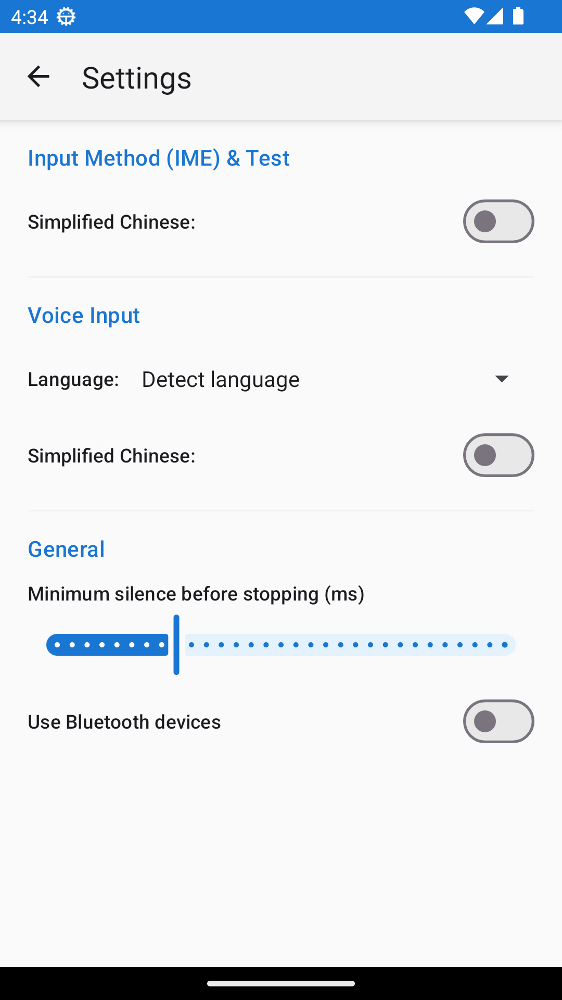
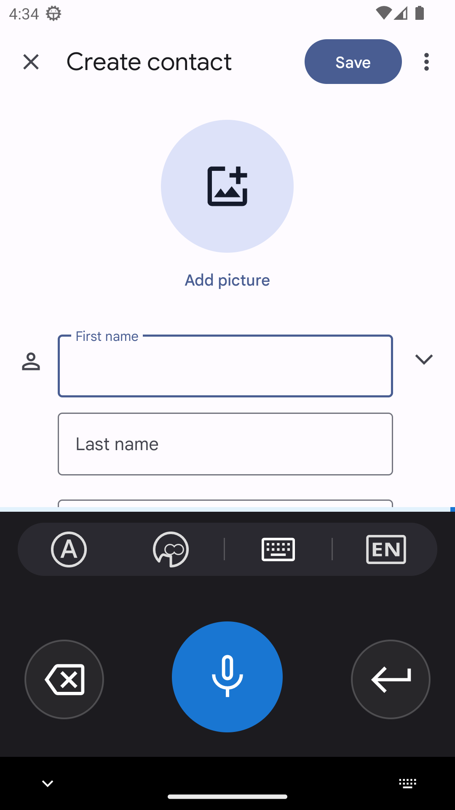
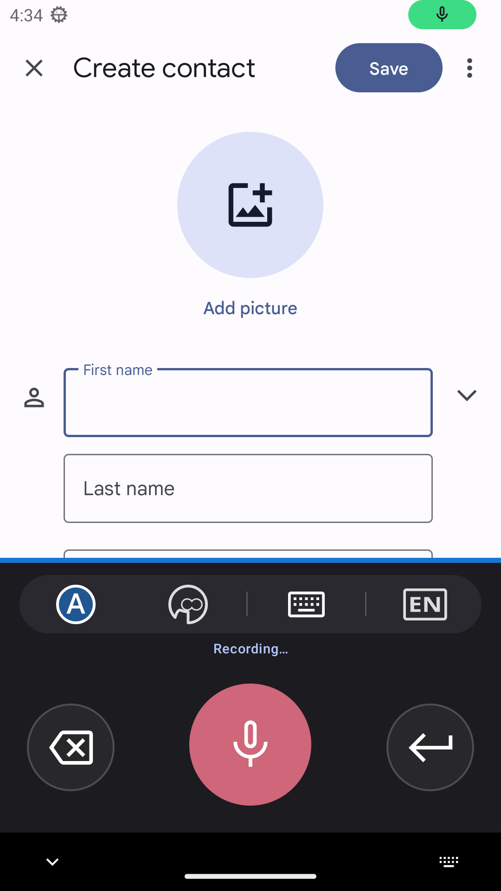
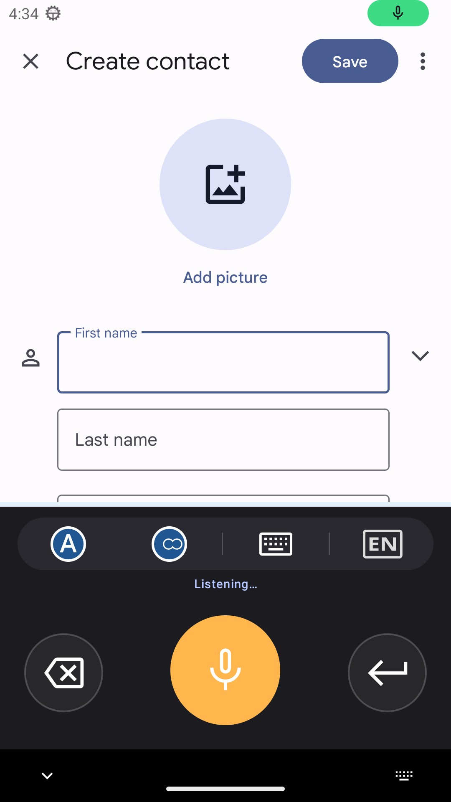
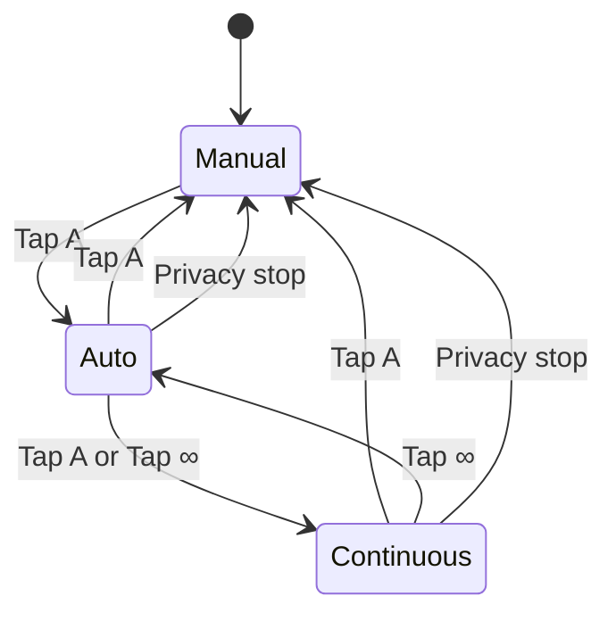
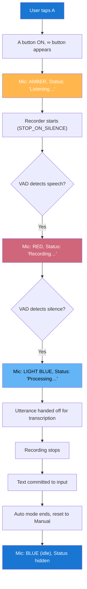
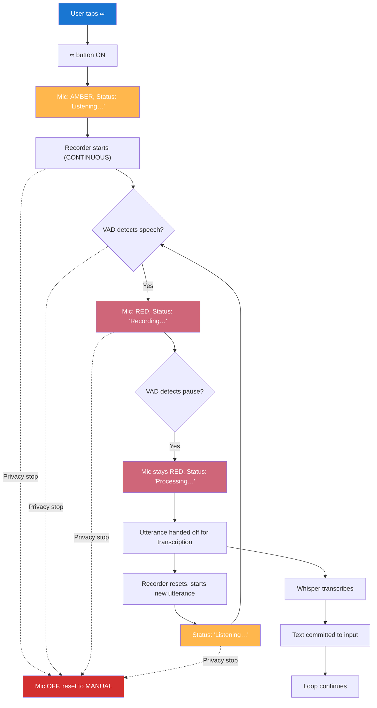
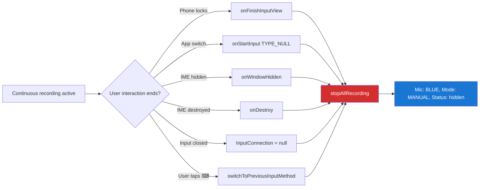

# WhisperVault — Private, Verified Voice Recognition

      

*MainActivity · RecognizeActivity (manual) · RecognizeActivity (auto, ∞ visible) · Settings · IME manual · IME auto · IME continuous (∞ active)*

WhisperVault is a security-hardened voice recognition IME built on OpenAI Whisper. It runs **entirely offline** — your audio never leaves the device.

## Security properties

- **100% offline inference** — no network access during recognition; audio stays on-device
- **Model integrity verification** — SHA-256 hashes checked at extraction and at every load across all five entry points; mismatches are surfaced to the user before any inference runs
- **Zip Slip protection** — canonical path validation on every entry before writing during model extraction
- **Minimal permissions** — `QUERY_ALL_PACKAGES` removed; package visibility declared via `<queries>` only
- **Hardened manifest** — setup and settings activities are not exported; `visibleToInstantApps` removed from recognition activity
- **Release build hardening** — R8 minification enabled with ProGuard rules that preserve ONNX Runtime reflection; ProGuard also strips diagnostic logging
- **No diagnostic leakage** — transcription output and target package names are gated behind `BuildConfig.DEBUG`; not present in release builds
- **Thread-safety** — `recognitionCancelled` and `isVerifying` declared `volatile`; `RecordBuffer` uses `ConcurrentLinkedQueue` for continuous mode and `AtomicReference` with consume-once `getAndSet(null)` semantics for single-buffer mode
- **47 tests** — 35 JVM unit tests (including Robolectric manifest checks) and 12 Espresso/UIAutomator E2E tests run against a real emulator with real ONNX inference

WhisperVault is a hardened fork of [whisperIMEplus](https://github.com/woheller69/whisperIMEplus). It has three distinct entry points, each with a different UI:

| Entry point | How it launches | UI | Screenshots |
|-------------|-----------------|-----|-------------|
| **Standalone app** (`MainActivity`) | Tap the app icon | Full-screen: text output area, copy button, Append/Translate toggles, mic button | 01 |
| **Voice input overlay** (`WhisperRecognizeActivity`) | Another app requests speech via `RecognizerIntent` (e.g. a search bar, assistant, or keyboard's mic key) | Floating dialog over the caller: cancel (✕), mode buttons (A / ∞), mic. No keyboard controls — the caller handles the returned text. Closes automatically after transcription. | 02, 03 |
| **IME keyboard** (`WhisperInputMethodService`) | User selects WhisperVault as their keyboard, or taps the mic button in HeliBoard | Bottom keyboard panel: mode strip (A / ∞ / ⌨ / EN), status line, mic button. Android draws the standard delete and enter keys below. Stays open while focus is in a text field. | 05, 06, 07 |

The voice input overlay (02, 03) intentionally has no keyboard controls because it is not a keyboard — it captures speech and returns the text string to the calling app via Android's `RecognizerIntent` API. The standalone app and IME both write text directly.

As a standalone app it can also translate any supported language to English.

## Initial Setup

Upon launching WhisperVault for the first time, you will need to download the Whisper model from Hugging Face and install it.
Voice recognition works entirely offline, ensuring your privacy and convenience.

Please note that for use as voice input (not as IME) there is a separate settings activity which can be accessed from Android settings
(System > Languages > Speech > Voice Input). There you can activate the app as voice input and then click the settings button.

If after installation you do not find WhisperVault as voice input or only see a limited list (hard-coded ones like Google/Samsung)
- enable USB debugging
- type adb shell settings put secure voice_recognition_service io.github.nick_tgcs.whispervault/com.whisperonnx.WhisperRecognitionService

## Using WhisperVault

To get the most out of WhisperVault, follow these simple tips:

- Press and hold the mic button while speaking (manual mode), or use auto/continuous mode
- Pause briefly before starting to speak
- Speak clearly, loudly, and at a moderate pace
- In continuous mode, just keep talking — pauses between sentences are transcribed automatically

### Recording Modes

WhisperVault supports three recording modes, controlled by the **A** (Auto) and **∞** (Continuous) buttons:

| Mode | How to activate | VAD behavior | Stops when | Mic button color |
|------|-----------------|-------------|------------|-----------------|
| **Manual** | Press & hold mic | Filters silence (pauses don't consume 30s buffer) | User releases button | Blue → Amber → Red → Light blue |
| **Auto** | Tap **A** | Stops on silence (one-shot) | Silence detected | Blue → Amber → Red → Light blue |
| **Continuous** | Tap **A** then **∞** | Hands off utterance on pause, keeps mic open | User taps **A** again, or privacy stop | Blue → Amber → Red (stays red during processing) |

**Button behaviors:**

| Button | Tap when A is off | Tap when A is on (auto) | Tap when A is on (continuous) |
|--------|-------------------|------------------------|-------------------------------|
| **A** | Activates auto mode | Switches to continuous mode | Deactivates — back to manual |
| **∞** | Not visible | Switches to continuous mode | Switches back to auto (one-shot) |
| **Mic** | Press & hold for manual recording | Disabled (A controls recording) | Disabled (∞ controls recording) |

### Mic Button Visual States

The mic button changes color to show what's happening:

| State | Color | Meaning |
|-------|-------|---------|
| Idle | Blue | Not recording — waiting for user action |
| Listening | Amber | Mic is open, VAD hasn't detected speech yet |
| Recording | Red | VAD detected speech, actively capturing |
| Processing | Light blue (auto/manual) or Red (continuous) | Transcribing audio |

### Auto Mode Flow

### Continuous Mode Flow

### Privacy: Microphone Stops on Loss of Focus

Continuous mode keeps the microphone open, which makes privacy safeguards critical. **The microphone stops immediately** when the user is no longer actively interacting with a text field:

**No recording ever continues in the background.** There is no scenario where the microphone is active while the user is not looking at a text field with WhisperVault as their active keyboard.

You can also let the app translate your input to English using the translate button.

# License
This work is licensed under GPLv3. Original code © woheller69. Modifications © 2026 nick-tgcs.
- This app is a fork of [whisperIMEplus](https://github.com/woheller69/whisperIMEplus), licensed under GPLv3
- whisperIMEplus is based on [whisperIME](https://github.com/woheller69/whisperIME), published under MIT license
- It uses code and the Whisper ONNX models from [RTranslator](https://github.com/niedev/RTranslator)
- It uses code from [Whisper-Android project](https://github.com/vilassn/whisper_android), published under MIT license
- It uses [OpenAI Whisper](https://github.com/openai/whisper) published under MIT license. Details on Whisper are found [here](https://arxiv.org/abs/2212.04356).
- It uses [Android VAD](https://github.com/gkonovalov/android-vad), which is published under MIT license
- It uses [Opencc4j](https://github.com/houbb/opencc4j), for Chinese conversions, published under Apache-2.0 license
- At first start you need to download the Whisper model from [HuggingFace](https://huggingface.co/huggingface0ddg0/whisperOnnx), which is published under MIT license

