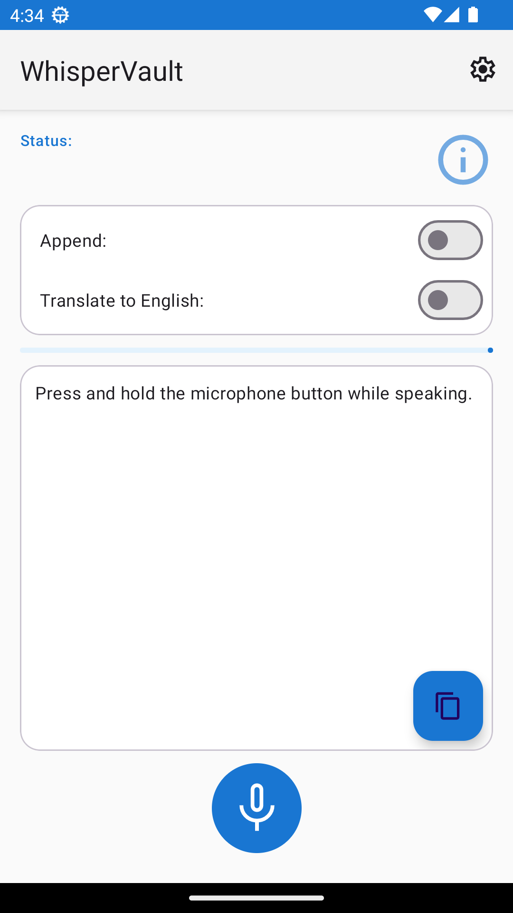
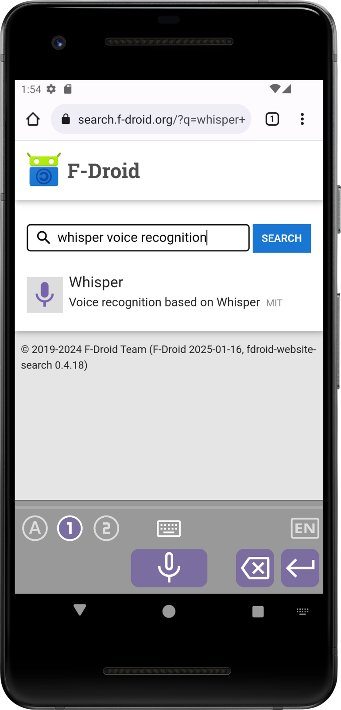
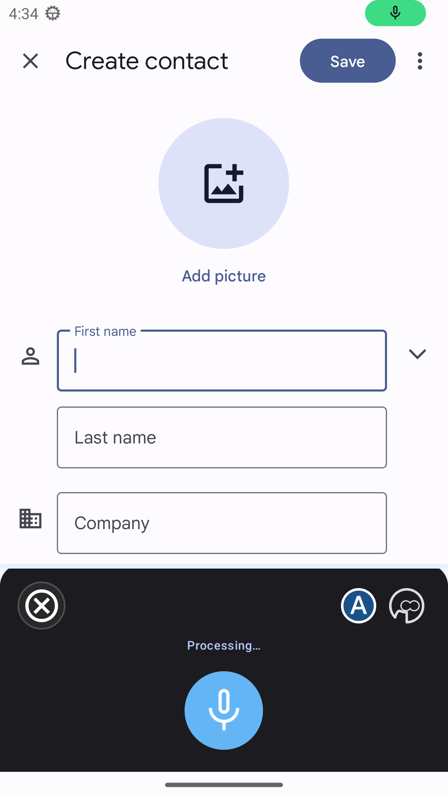

# WhisperVault — Private, Verified Voice Recognition

  

WhisperVault is a security-hardened voice recognition IME built on OpenAI Whisper. It runs **entirely offline** — your audio never leaves the device.

## Security properties

- **100% offline inference** — no network access during recognition; audio stays on-device
- **Model integrity verification** — SHA-256 hashes checked at extraction and at every load across all five entry points; mismatches are surfaced to the user before any inference runs
- **Zip Slip protection** — canonical path validation on every entry before writing during model extraction
- **Minimal permissions** — `QUERY_ALL_PACKAGES` removed; package visibility declared via `<queries>` only
- **Hardened manifest** — setup and settings activities are not exported; `visibleToInstantApps` removed from recognition activity
- **Release build hardening** — R8 minification enabled with ProGuard rules that preserve ONNX Runtime reflection; ProGuard also strips diagnostic logging
- **No diagnostic leakage** — transcription output and target package names are gated behind `BuildConfig.DEBUG`; not present in release builds
- **Thread-safety** — `recognitionCancelled` and `isVerifying` declared `volatile`; `RecordBuffer` uses `AtomicReference` with consume-once `getAndSet(null)` semantics
- **47 tests** — 35 JVM unit tests (including Robolectric manifest checks) and 12 Espresso/UIAutomator E2E tests run against a real emulator with real ONNX inference

WhisperVault is a hardened fork of [whisperIMEplus](https://github.com/woheller69/whisperIMEplus). It functions as a standalone app, an IME (e.g. activated via the microphone button in HeliBoard), and a system-wide `RecognitionService` supporting `RecognizerIntent.ACTION_RECOGNIZE_SPEECH`.

As a standalone app it can also translate any supported language to English.

## Initial Setup

Upon launching WhisperVault for the first time, you will need to download the Whisper model from Hugging Face and install it.
Voice recognition works entirely offline, ensuring your privacy and convenience.

Please note that for use as voice input (not as IME) there is a separate settings activity which can be accessed from Android settings
(System > Languages > Speech > Voice Input). There you can activate the app as voice input and then click the settings button.

If after installation you do not find WhisperVault as voice input or only see a limited list (hard-coded ones like Google/Samsung)
- enable USB debugging
- type adb shell settings put secure voice_recognition_service io.github.nick_tgcs.whispervault/com.whisperonnx.WhisperRecognitionService

## Using WhisperVault

To get the most out of WhisperVault, follow these simple tips:

- Press and hold the button while speaking or use automatic mode where available
- Pause briefly before starting to speak
- Speak clearly, loudly, and at a moderate pace
- Please note that there is a limit of 30s for each recording. For longer transcriptions briefly release the button and press it again. You can continue to speak while transcription is running.

By following these guidelines, you'll be able to enjoy accurate and efficient voice recognition with WhisperVault.

You can predefine 2 languages and quickly switch between them. You can also let the app translate your input to English.

# License
This work is licensed under GPLv3. Original code © woheller69. Modifications © 2026 nick-tgcs.
- This app is a fork of [whisperIMEplus](https://github.com/woheller69/whisperIMEplus), licensed under GPLv3
- whisperIMEplus is based on [whisperIME](https://github.com/woheller69/whisperIME), published under MIT license
- It uses code and the Whisper ONNX models from [RTranslator](https://github.com/niedev/RTranslator)
- It uses code from [Whisper-Android project](https://github.com/vilassn/whisper_android), published under MIT license
- It uses [OpenAI Whisper](https://github.com/openai/whisper) published under MIT license. Details on Whisper are found [here](https://arxiv.org/abs/2212.04356).
- It uses [Android VAD](https://github.com/gkonovalov/android-vad), which is published under MIT license
- It uses [Opencc4j](https://github.com/houbb/opencc4j), for Chinese conversions, published under Apache-2.0 license
- At first start you need to download the Whisper model from [HuggingFace](https://huggingface.co/huggingface0ddg0/whisperOnnx), which is published under MIT license

